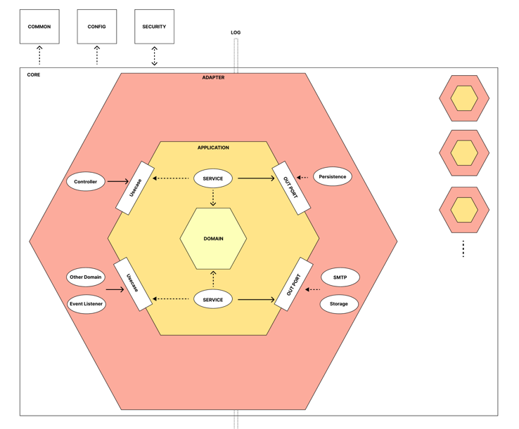

# 토이프로젝트에 헥사고날을 적용해보았다

# 레이어드 아키텍처의 한계점

가장 큰 문제는 도메인이 인프라에 종속된다는 점이다.

객체와 데이터의 간극을 어떻게 헤아릴 것인가?

# 헥사고날이란?

# 장점

순수한 도메인

테스트 하기 용이함.

메서드 단위 이동이 쉬움

adapter 변경에 용이

# 단점

구조적 복잡도

어댑터가 보통 하나만 있는데? 그러면 레이어드랑 다를것이 뭐야?

# 개인적인 생각

솔직한 생각으로는 도메인 로직이 단순할 수록 생각보다 비효율적이다.
단순한 CRUD여도 수많은 클래스들을 생성하는 것을 보고 효율적이지 못하다는 판단을 했다.
허나 복잡한 로직일수록 얻는 이점은 극대화 된다. 인프라에 대해 신경쓰지 않고 순수한 객체만으로 로직을 작성하니 구현 측면해서는 훨씬 용이했다.
하지만 이 부분도 레이어드여서도 추상화만 잘 관리하면 충분히 도메인 격리가 가능하다 생각했다.

그럼 언제 헥사고날이 용이할까?
개인적인 생각으로는 input/output adapter가 변경이 많은 케이스에서 헥사고날의 이점을 극대화할 수 있을 것 같다
또한, 굳이 모든 도메인에 같은 아키텍처를 가져갈 필요도 없는 것 같다. 각 도메인에 맞게 적절한 아키텍처를 사용하여 구조화하는 것이 맞다 판단된다.

# 결론
내가 이 프로젝트에서 헥사고날을 적용한 것은 양날의 검이라 생각한다. 통일성이랍시고 모든 도메인에 헥사고날을 적용한게 도리어 개발에 대한 복잡도만 높인것이 아닐까 싶다.  
허나 이점을 취한 부분도 분명히 존재한다. 다음에 개발을 임할때는 도메인 별로 이점을 극대화하는 방향으로 유연한 설계를 가져가지 않을까 싶다.

틀을 맞춰 개발한다기 보다는 구현을 하면서 점진적으로 설계해나가 아키텍처를 확장해도 좋은 방식인 것 같다.

은총알은 없다. 허나, 최선은 있다. 도메인 복잡도, 개발 팀 전략에 따라 아키텍처도 유연하게 가져가야한다 생각한다.
