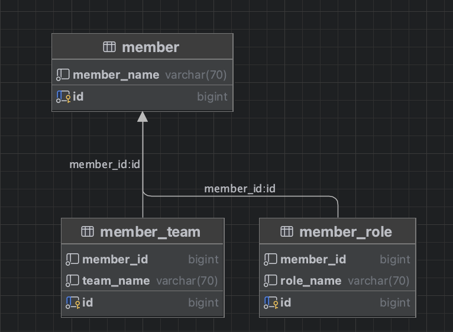
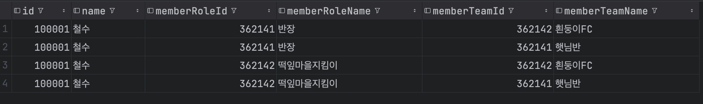
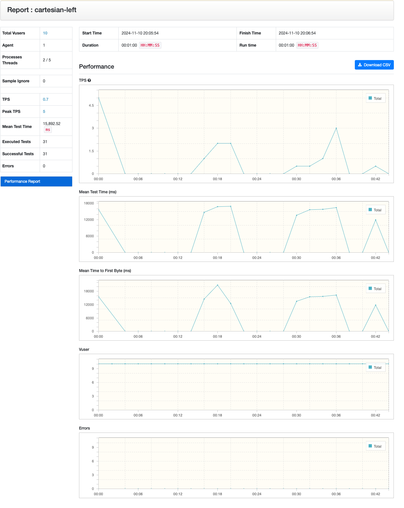
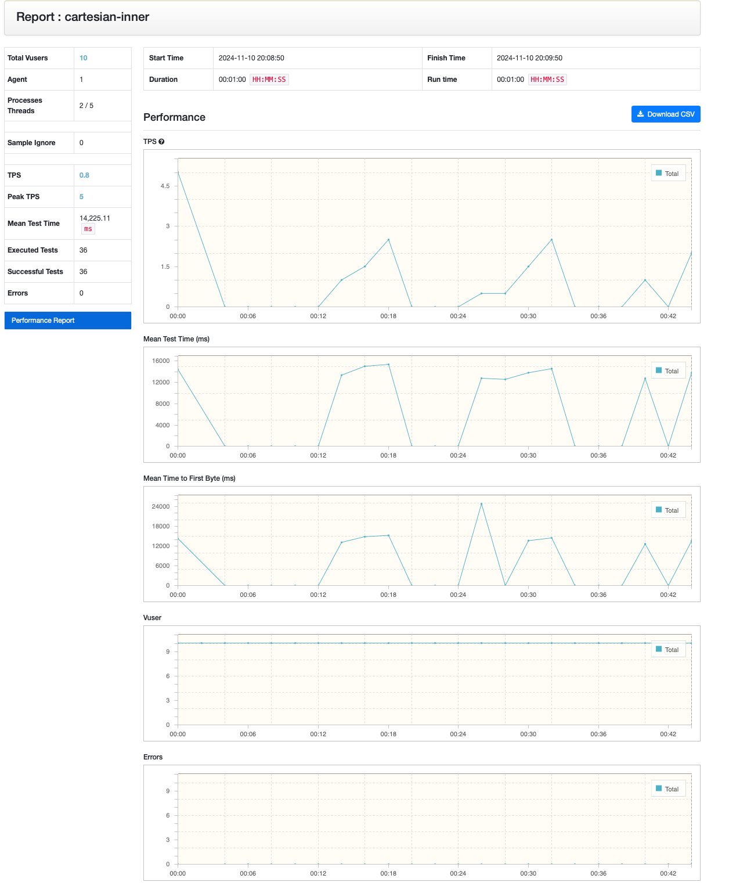
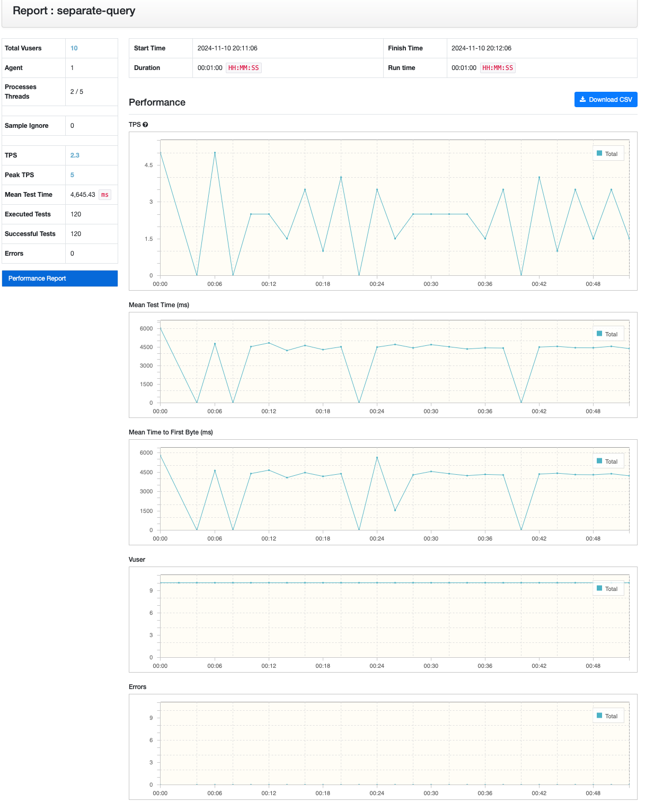
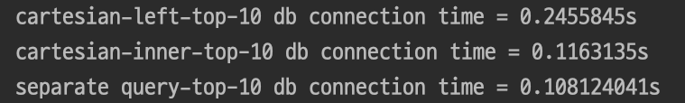
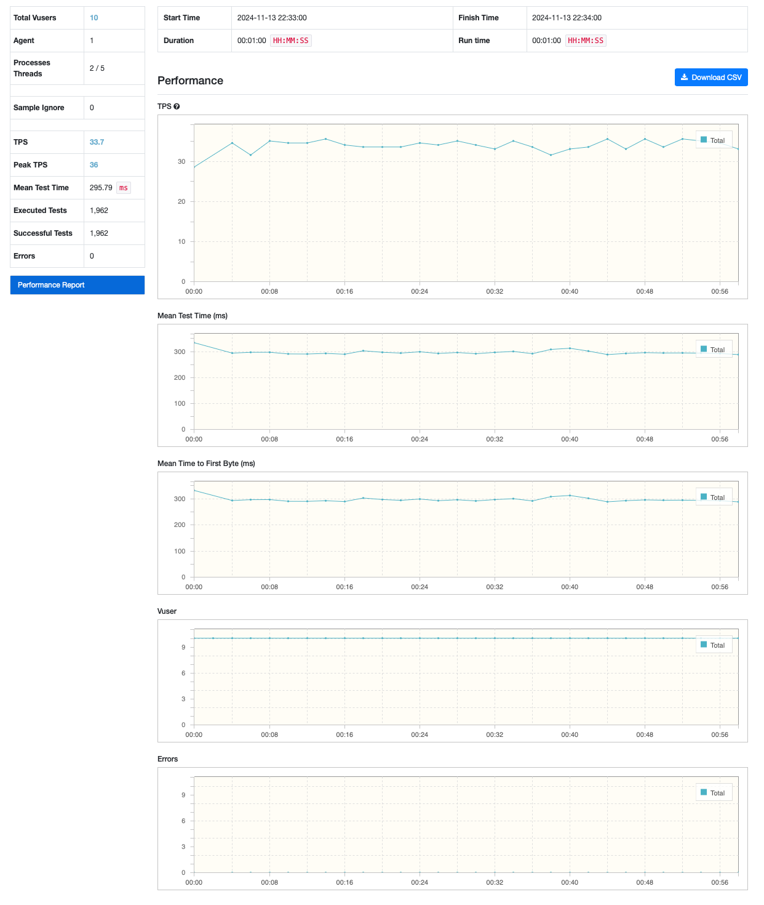
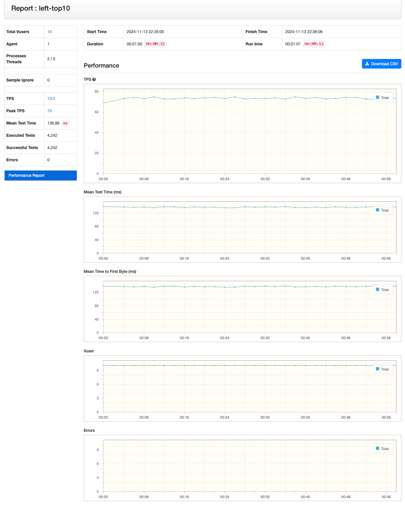
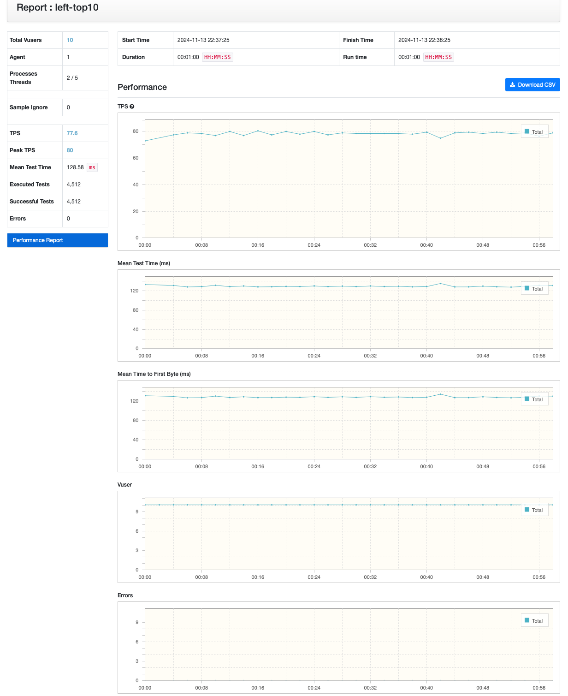

# 쿼리 분리 VS 카테시안 곱 허용하기


# 들어가기 앞서
이 포스팅은 DOKBARO를 개발하면서 경험한 것을 기반으로 제작하였습니다.
### DOKBARO란 ?


# 서론
간혹, DB 접근 수를 줄이기 위해 카테시안 곱을 묵인하는 경우가 많은데요!  
그랬을 경우 불필요한 메모리 사용량도 야기되지만, 간혹 실행 속도를 줄이기 위해 쿼리를 분리하는대신, 카테시안 곱이 적용되는 쿼리를 취하는 경우를 보았습니다!  
허나, 단순히 쿼리 수를 줄인하고 해도 과연 실행 속도를 줄일 수 있을까요? 아래 테스트를 통해 직접 알아보겠습니다.  
# 사례 설명
성능 테스트를 위한 간단한 사례를 설명드리겠습니다.  


위 상황에서, 우리는 member가 속한 팀 목록과, member의 역할을 조회하고자 합니다.  
샘플 데이터는 member 10만 건, role 30만 건, team 30만 건을 기반으로 진행하였습니다.  

테스트에서 사용된 코드는 다음 링크를 참고해주시면 감사하겠습니다  
https://github.com/phjppo0918/blog-code/tree/main/database/cartesian/ep1

# 카테시안 곱이란?
본격적으로 들어가기 앞서, 카테시안 곱에 대해 간단히 설명 드리고자 합니다.  
한 테이블을 대상으로 2개 이상의 table에 조인 시 결합으로 이루어질 수 있는 모든 경우의 수를 결과값으로 변환하는 현상을 말합니다.  
데카르트 곱이라고도 합니다.

예를 들어, "반장"과 "떡잎마을지킴이"를 하고있는 "철수"가 "흰둥이FC" 와 "햇님반" 에 속해있으면, 단일 쿼리 조회 시 다음과 같이 결과가 도출됩니다.

이러한 현상을 카테시안 곱이라 합니다.


# 성능 측정
## 단순 쿼리 시간 측정
우선, 가볍게 쿼리 실행 시간이 얼마나 걸리는지 아래와 같이 실행 시간을 측정했습니다!
```kotlin
fun getCartesianLeft(): Collection<MemberResponse> {
        val startTime = System.nanoTime()
        val selectTotal: Collection<MemberTotalData> = sampleRepository.selectTotalLeftJoin()
        val endTime = System.nanoTime()

        println("cartesian-left db connection time = ${(endTime - startTime) / 1000000000.0}s")
        ...
    }

    fun getCartesianInner(): Collection<MemberResponse> {
        val startTime = System.nanoTime()
        val selectTotal: Collection<MemberTotalData> = sampleRepository.selectTotalInnerJoin()
        val endTime = System.nanoTime()

        println("cartesian-inner db connection time = ${(endTime - startTime) / 1000000000.0}s")
        ...
    }

    fun getSeparateQuery(): Collection<MemberResponse> {
        val startTime = System.nanoTime()
        val members = sampleRepository.selectMember()
        val roles = sampleRepository.selectRole().groupBy { it.memberId }
        val teams = sampleRepository.selectTeam().groupBy { it.memberId }
        val endTime = System.nanoTime()

        println("separate query db connection time = ${(endTime - startTime) / 1000000000.0}s")
        ...
    }
```
그랬더니 결과는...다음과 같습니다!

```
cartesian-left db connection time = 7.908462167s // 3rd
cartesian-inner db connection time = 6.413592375s // 2nd
separate query db connection time = 2.898180333s  // 1st
```

쿼리를 쪼개서 실행한 것이, 카테시안 곱을 허용한 것 보다 실행 시간이 더 짧은 것을 알 수 있었습니다.   
더 자세한 성능 지표를 보기 위해 ngrinder를 통한 테스트도 진행해볼까요?

## ngrinder 을 이용한 테스트 결과
vuser를 더 늘리고 싶었는데... 여기서 더 늘리면 실패 확률이 많이 생겨서,  
모두가 success 할 수 있는 vuser 개수를 기준으로 진행하였습니다.

### cartesian - left join 

### cartesian - inner join

### 쿼리 분리


각 TPS가 카테시안(left join)은 0.7, 카테시안(inner join)은 0.8, 쿼리 분리는 2.3으로 나왔네요!  
ngrinder를 통한 성능 지표를 봐도 쿼리 분리하는 케이스가 월등히 높은 것을 알 수 있었습니다!  
카테시안 곱을 허용하는 것에 비해 약 3배 정도 성능이 좋은 것을 알 수 있었습니다.

# 한 방 쿼리 실행 계획
카테시안 곱을 허용한 한 방 쿼리에 대해 실행 계획을 한번 살펴보겠습니다. inner join 한 예시를 기반으로 살펴볼게요!
```
-> Inner hash join (r.member_id = t.member_id)  (cost=30937 rows=29929) (actual time=261..1652 rows=900000 loops=1)
    -> Table scan on r  (cost=4000 rows=299292) (actual time=0.0161..65.2 rows=300000 loops=1)
    -> Hash
        -> Nested loop inner join  (cost=0.7 rows=1) (actual time=0.0615..226 rows=300000 loops=1)
            -> Table scan on t  (cost=0.35 rows=1) (actual time=0.0478..73.1 rows=300000 loops=1)
            -> Single-row index lookup on m using PRIMARY (id=t.member_id)  (cost=0.35 rows=1) (actual time=380e-6..401e-6 rows=1 loops=300000)
```
테이블 r과 t를 member_id 를 기준으로 join을 진행하는 데 실행 시간을 많이 소비한 것을 볼 수 있습니다.  
hash join을 했음에도 불구하고, 행 수가 많아서 실행시간이 오래 걸리는 것이라 볼 수 있습니다.  


# 이보시오! 데이터가 너무 많은거 아니오?
90만 개의 데이터가 크로스 된 경우인데, 실제로는 이렇게 많은 데이터를 한 번에 부르는 경우는 많이 없을 것입니다!  
따라서 데이터를 조금 줄여보도록 하겠습니다. 단순히 member가 10명인 경우만 가정해볼까요??

단순히 쿼리 실행 시 DB 커넥션 시간을 로그로 출력해보겠습니다.  


데이터 모수를 줄였음에도 불구하고, 쿼리 분리가 약소하게나마 우세한 것을 볼 수 있습니다.  
좀 더 정확한 측정을 위해 ngrinder를 통해서 한 번 더 테스트 진행해보도록 하겠습니다.  

### cartesian - left join


### cartesian - inner join


### 쿼리 분리


각 TPS가 카테시안(left join)은 33.7, 카테시안(inner join)은 73, 쿼리 분리는 77.6으로 나왔네요!  
데이터 모수를 줄였음에도 불구하고, 쿼리를 분리하는 케이스가 성능이 좀 더 좋을 것 을 파악할 수 있었습니다.  
개인적으로, 개발할 때에도 쿼리를 분리하는 경우가 좀 더 수월했는데요!  
카테시안 곱이 적용된 데이터에는 null 제거 밎 중복 처리 제거 등을 진행해야 했고, 
심지어 join수가 많아지면, 데이터가 곱으로 늘어나는 현상을 볼 수 있었습니다.  
또한, 페이징 처리 시에도 곤란한 부분이 많았는데요! 무조건 한 방이라고 좋게 평가할 수는 없을 것 같습니다.  

# 마무리
이처럼, 카테시안 곱이 성능 저하를 야기할 수도 있다는 것을 이번 실험을 통해 알아볼 수 있었습니다.  
앞으로는 가능한, 쿼리를 분리하여 사용하는 것이 좋을 것 같네요!  
실제로 DOKBARO 프로젝트에서도 카테시안 곱으로 동작한 부분을 쿼리 분리로 해결해서 비약적으로 성능 향상을 얻은 경우도 있었습니다!    
물론, 애플리케이션 상태에 따라 다를 수 있다 생각합니다.  
위 테스트는 로컬 내에서만 테스트를 진행하였기 때문에, 다른 환경에서는 결과가 달라질 수도 있을 것 같네요!  
각자 환경에 맞게 진행하면 좋을 것 같습니다.  

그럼 이것으로 이번 포스팅을 마치겠습니다. 긴 글 읽어주셔서 감사합니다!