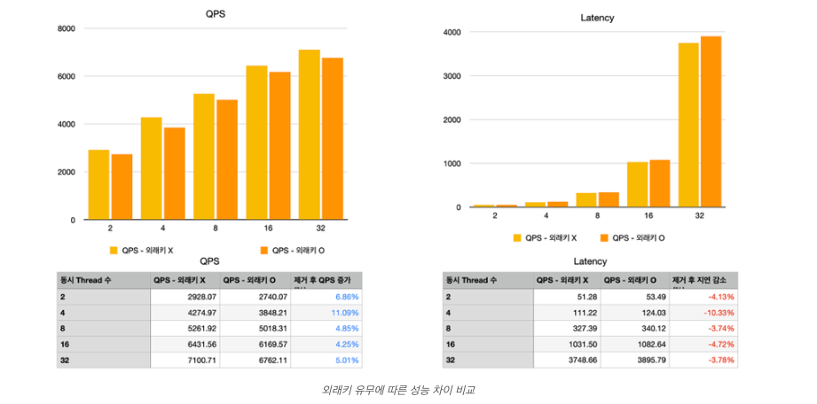

# DB에서 외래키는 꼭 설정해야할까?

sql AntiPatterns 를 읽다 보면 다음과 같은 문구가 있습니다.
> FK에 대한 선언이 빠져있으면 부모테이블에 있는 값과 대응되도록 강제할 수 없고, 데이터 정합성도 보장할 수 없다.

허나 전 회사에서는 사내에서는 FK를 하나도 설정하지 않고 있었는데요!   
이유는 데이터 정합성을 맞출 수 없기 때문에 일부로 설정을 하지 않는 거였습니다.  
뭐 이해는 합니다. 계속 변경되는 요구사항에 데이터가 같이 움직이기라는 쉽지 않거든요!  
하지만 틀어지는 데이터 정합성을 잡기 위해 애플리케이션에서 별도 로직을 만들다보면 차라리 외래키를 설정하는게 나을거 같지 않나...생각을 많이 했습니다.  
그럼 FK를 설정했을 때 장단점은 무엇이 있을까요?

# 외래키 설정 시에 장점

## 1. 데이터 무결성을 보장할 수 있다. 
insert, update 시에 fk에 관한 부모 테이블에 값을 확인하고,  
delete 시에는 부모 테이블의 컬럼을 삭제 시 자식테이블에 참조 무결성 제약(RESTRICT, CASCADE 등)을 설정할 수 있기에 데이터가 깨지는 현상을 방지할 수 있습니다.
## 2. 이중 목적에 대해 방지할 수 있다.
이중 목적을 다른 용어로 다형성 연관(polymorphic Associations), 난잡한 연관(promiscuous association) 이라고 하는데,  
한 FK에 여러 테이블이 참조하는 현상을 말합니다. 테이블의 복잡도와 데이터와 메타데이터의 혼용을 이유로 sql AntiPatterns 에서는 안티패턴으루 규정하는데요!  
FK를 설정해두면 한 테이블만 참조할 수 있기에 이중 목적을 방지할 수 있습니다.
## 3. 별도 문서화를 안해도 해당 컬럼이 어느 테이블과 연관되어 있는지 알 수 있다.
하... 이 부분은 전 회사에서 심각하게 겪은 문제인데 아니 외래키를 설정해두고 관련 테이블을 명시를 안해놔서 애플리케이션 내에서 어떤 테이블과 연관되어있는지 일일이 찾았습니다..  
FK를 설정했으면 바로 어떤 테이블과 연관되어 있는지 알 수 있었을텐데 말이죠!

# 외래키 설정 시에 단점
장점만 있었으면 모든 DB가 외래키를 설정했을 겁니다! 그럼 어떤 단점이 있는지 알아볼까요?
## 1. 유연성이 감소한다
이 부분이 가장 큰 문제죠. FK에 관한 데이터를 강제하기 때문에 임의의 값을 넣을 수 없어 유연성이 감소하는 문제가 있습니다.  
요구사항 변경에 따른 데이터 변경, 데이터 hard delete 시, batch 처리 등 다양한 케이스에서 유연성의 제약을 크게 느낄 수 있는 단점이 있습니다.
## 2. DB Slice test가 힘들다
이 부분은 제가 크게 느낀 부분인데요! application에서 DB 레벨 slice test 시에 FK에 연관 테이블을 싹 다 저장을 한 상태에서야 테스트가 가능하기에 번거로움이 자주 느껴졌습니다.

## 3. 외래키에 대한 성능 문제?
주로 DML시에 fk에 관한 컬럼 존재 여부를 확인하고, 부모 테이블에 락을 걸기 때문에 성능 저하가 있을 수 있습니다.  
허나 이러한 문제가 치명적이라기에는 저하되는 값이 미미하고(최대 약 10%), 성능 향상을 위해 FK를 해제하는 것은 최후의 수단으로 보류해야하지 않나 싶습니다.  

그래프 출처 https://martin-son.github.io/Martin-IT-Blog/mysql/foreign%20key/performance/2022/02/28/foreign-key-Performance.html

# 개인적인 해결 방법
그럼 FK를 설정해야 할까요 하지 말아야 할까요?  
저만의 해결방법은 바로 데이터가 깨지면 안되는 부분만 FK를 설정한다는 것입니다. 생각보다 데이터 정합이 필요 없는 부분이 상당히 있거든요!
무결성에 대한 요구사항을 분석해서 설정 범위를 조절하면 좋을 것 같습니다.  
물리적으로 FK를 설정하지 않더라도, 어떤 연관관계를 가지고 있는 지 description을 할 필요가 있습니다! 안그러면 해당 테이블을 처음 접하는 사람들은 혼란이 오거든요!  
그럼 이것으로 포스팅 마치겠습니다! 긴 글 읽어주셔서 감사합니다!