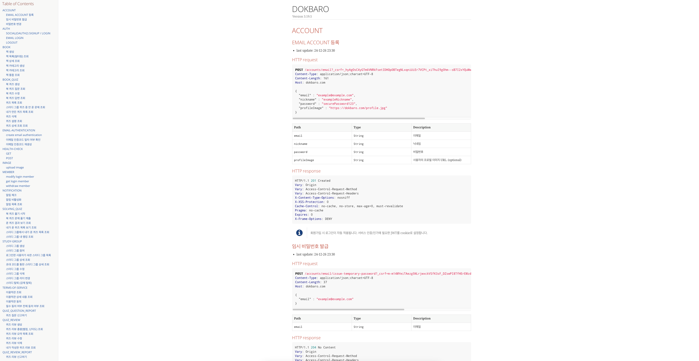
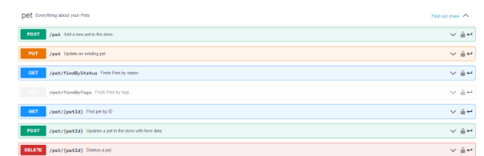

# 내가 Swagger보다 Rest doc 방식을 선호하는 이유

# 들어가기 앞서
이 포스팅은 DOKBARO를 개발하면서 경험한 것을 기반으로 제작하였습니다.
### DOKBARO란 ?
자기계발과 성장을 위해 독서와 스터디를 활용하는 **개발자들을 위한 퀴즈 학습 플랫폼, DOKBARO**입니다.

개발 서적을 즐겨 읽지만, **매번 내용을 제대로 이해했는지 확인하기 어렵지 않으셨나요?** 혹은 이해 부족으로 인해 **독서 스터디가 소수만 적극적으로 참여하는 형태로 변질되는 경험**을 하셨을지도 모릅니다.

그래서, **DOKBARO는**

📚 **퀴즈 출제 및 풀이 기능**으로 도서 내용을 재미있고 효과적으로 이해하도록 도와드려요.

💡 **스터디 리포트 기능**으로 스터디원들이 책에 대해 자유롭게 의견을 나누고, 서로의 학습 현황을 확인할 수 있어요.

**DOKBARO와 함께라면** 도서 이해도를 높이고, 스터디 활동을 보다 풍성하고 활발하게 만들어 이상적인 독서 환경을 경험하실 수 있습니다. ✌️

현재는 알파테스트 중에 있으니, 조금만 더 보완해서 여러분들께 선사하도록 하겠습니다!

# 서론

# 싫은 이유

- main 코드에 침투적임
- 코드와 문서가 상이할 수 있음.

- swagger 장점
- 간편함
- UI가 예쁨  

- 프론트가 더 선호함

# 결론
