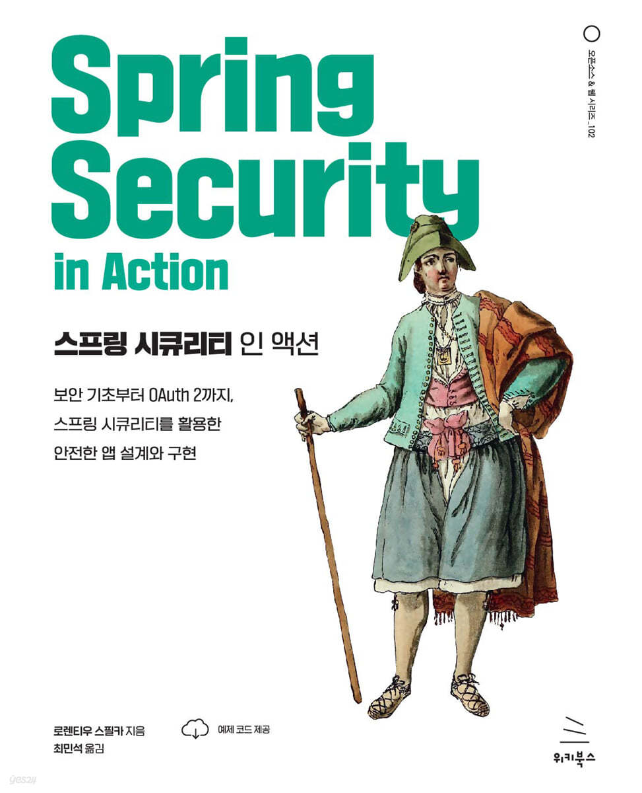
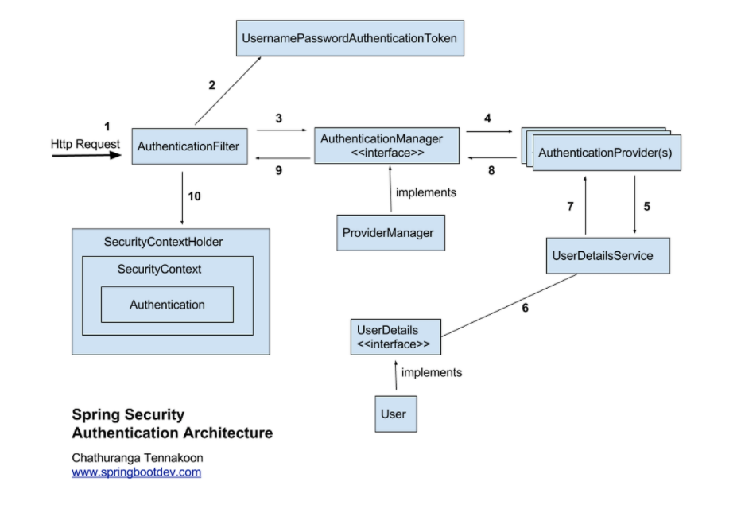
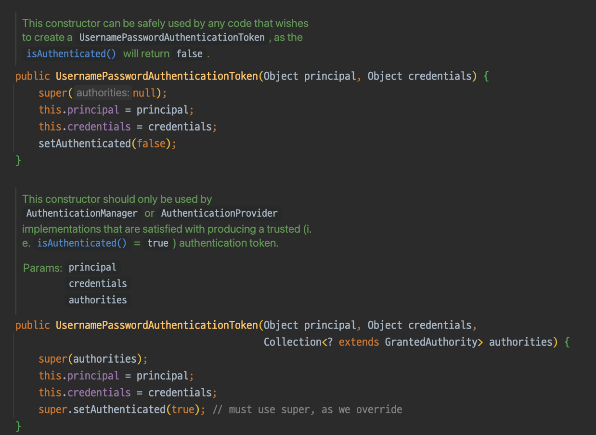

# 스프링 시큐리티 쓸 때 왜 다들 필터에 몰빵하는거야

# 서론
구글링을 하다보면 시큐리티에 대한 블로그에 샘플 코드가 많은 것을 볼 수 있다.  
허나 상당수의 코드가 filter에만 모든 기능을 몰아서 구현한 것을 볼 수 있다.  
근래 Spring security in action 책을 읽었는데, 위같은 방식이 매우 잘못됨을 인지했고, Security 내 클래스별로 각각 어떤 역할을 하는지 한번 알아보도록 하자

# Dokbaro

# Spring Security 구조

# Filter도 종류가 다양해

# 각종 handler도 설정해줘

# 인증 실패는 AuthenticationEntryPoint를 통해서

# etc

## 1. filter bean 으로 선언하는 것 지양

## 2. Authentication 객체에 대한 가변성
특히 Authentication 구현체 중 하나인 UsernamePasswordAuthenticationToken 를 사용시에는 authorities가 있으면 인증된 것으로 인지하니 사용 시 유의해야 합니다.

# 결론
결국 스프링 시큐리티도 스프링을 기반으로 한다. 각 객체를 bean으로 생성하고, 역할과 책임에 맞게 구성이되어야하지 않나 생각한다. 
