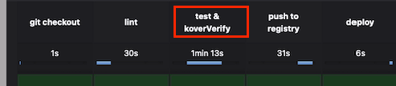

# 나는 왜 테스트 커버리지 100% 에 혈안이 되었을까

# 들어가기 앞서
이 포스팅은 DOKBARO를 개발하면서 경험한 것을 기반으로 제작하였습니다. 
### DOKBARO란 ?
자기계발과 성장을 위해 독서와 스터디를 활용하는 **개발자들을 위한 퀴즈 학습 플랫폼, DOKBARO**입니다.

개발 서적을 즐겨 읽지만, **매번 내용을 제대로 이해했는지 확인하기 어렵지 않으셨나요?** 혹은 이해 부족으로 인해 **독서 스터디가 소수만 적극적으로 참여하는 형태로 변질되는 경험**을 하셨을지도 모릅니다.

그래서, **DOKBARO는**

📚 **퀴즈 출제 및 풀이 기능**으로 도서 내용을 재미있고 효과적으로 이해하도록 도와드려요.

💡 **스터디 리포트 기능**으로 스터디원들이 책에 대해 자유롭게 의견을 나누고, 서로의 학습 현황을 확인할 수 있어요.

**DOKBARO와 함께라면** 도서 이해도를 높이고, 스터디 활동을 보다 풍성하고 활발하게 만들어 이상적인 독서 환경을 경험하실 수 있습니다. ✌️

현재는 알파테스트 중에 있으니, 조금만 더 보완해서 여러분들께 선사하도록 하겠습니다!

# 기존 회사 테스트 방식
전 회사에서는 다음과 같이 테스트를 진행했습니다!
1. 브라우저에서 curl 복사  

2. postman에다가 붙여넣기
3. 실행  

이렇게 UI 단에서 테스트를 진행하고 있었습니다! 자그마한 수정을 해도 이를 검증하기 위해 UI단에서 직접 실행해야만 했고,  
특히 기능 변경시에 변경에 따른 타 컴포넌트의 영향력을 알 방법이 없었습니다.  
굳이 curl 복사하지 않고 postman으로 바로 요청하면 되는거 아니야?? 하시는 분들도 분명 있으실겁니다!  
허나 API 당 파라미터가 기본 30개 이상인 API 도 많았어서 수기로 직접 요청을 보내기에는 무리가 많았던 환경이었습니다...ㅎㅎ  

# 내 서비스 만큼은 저렇게 키우지 말아야지
회사 업무를 통해 단위 테스트의 필요성을 절실히 느낀 저는 이번에 진행하는 프로젝트 만큼은 단위 테스트를 신경써서 하기로 결심했습니다.  
그래서 모든 부분에 대해 테스트를 진행하자! 라는 마인드로 커버리지 100 달성을 목표로 애플리케이션을 개발하였습니다.
  
이런 식으로 kover을 통해 커버리지 100% 제한을 설정했고,  
  
jenkins 빌드 시에도 kover verify를 실행시켜 커버리지가 충족이 안되면 빌드가 불가능하도록 구현했습니다.  

- 장점
1. postman은 켠 지가 언제였더라...
2. 기능 변경 / 리펙터링 시 안정성 확보
3. 계층 테스트도 검증

- 문제점
1. 단순한 CRUD 로직이여도 테스트를 추가해야 함
2. 구멍이 없을 것 같아?

- 향후 진행 방식
- 필요한 부분만 커버리지 100
- 커버리지 100이 좋은 지표라고 명할 수 없음. 분명 결점이 있을 수 있다.
- 허나, 커버리지를 지향하다보면 이런 결점을 점진적으로 메꿀 수 있다.
- 테스트는 양보다 질
- 테스트 또한 문서
# 결론
- 상황에 맞게 커버리지를 활용